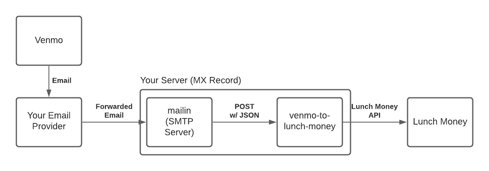

# Venmo to Lunch Money

A simple SMTP server that transforms Venmo emails into [Lunch Money][lunch-money] transactions.

This project is just a result of a two-night hack session. I can't guarantee
correctness or privacy conciousness.

**Use at your own risk.**

<!--
## Background

### How it works



1. Venmo sends an email to you.
2. You forward the email to your server, running [mailin][mailin].
3. mailin sends a JSON object to **venmo-to-lunch-money**.
4. **venmo-to-lunch-money** creates a Lunch Money transaction.
-->

## Run with Docker

1. Install Docker.
2. Create a `docker-compose.yml` file with the following contents.

```
---
version: '3.8'
services:
  venmo-to-lunch-money:
    image: billycao/venmo-to-lunch-money
    container_name: venmo-to-lunch-money
    environment:
      - API_TOKEN=
    ports:
      - 25:25
    volumes:
      - data:/data
    restart: unless-stopped

volumes:
  data:
```

3. Add your [Lunch Money access token][lunch-money-token] after `API_TOKEN=` and then run

```
docker compose up
```

## Local Installation

Previously, venmo-to-lunch-money used an external service ([mailin][mailin]) to receive emails
and POST those emails to it as a webhook.

This had the benefit of allowing the user to run this tool with an alternate SMTP server or any system that
sent webhooks.

However due to the lack of maintenance of mailin and other ultra-lightweight email-to-webhook tools I found,
I've decided to bundle in the SMTP server as part of venmo-to-lunch-money.

If you're interested in using this tool with a different workflow, feel free to fork or send a PR. :)

### Set up venmo-to-lunch-money

1. Clone the repo:
```
git clone git@github.com:billycao/venmo-to-lunch-money.git
cd venmo-to-lunch-money
```

2. Add your Lunch Money API Token to `config/default.yml`.
```yaml
lunch-money:
  api-token: '1234567890123456789013245678901213457890'
```

3. Start venmo-to-lunch-money.
```
npm install
npm build
npm start
```

4. Send emails to `nobody@localhost`.

Where "localhost" is the host at which venmo-to-lunch-money is running. (you may need to set up MX records)

## Configuration

Additonal configuration settings like notes on transactions, currency, etc. can
be found in `config/default.yml`. Regexes and selectors for email parsing
can also be found there, so if Venmo changes their email format and something breaks,
that would be the first place to look.

## Contribution

I made this as just a 2-day hack. I'll try to maintain it for my own use but
have few cycles to contribute.

If you'd like to take over, please feel free to fork it and post on the Lunch Money slack community (avialable to all Lunch
Money subscribers).

I'll try to remain responsive to all issues and PRs, and you can reach me at
[the.billy.c@gmail.com](mailto:the.billy.c@gmail.com).

[lunch-money]: https://lunchmoney.app/
[lunch-money-token]: https://my.lunchmoney.app/developers
[mailin]: https://www.npmjs.com/package/mailin
